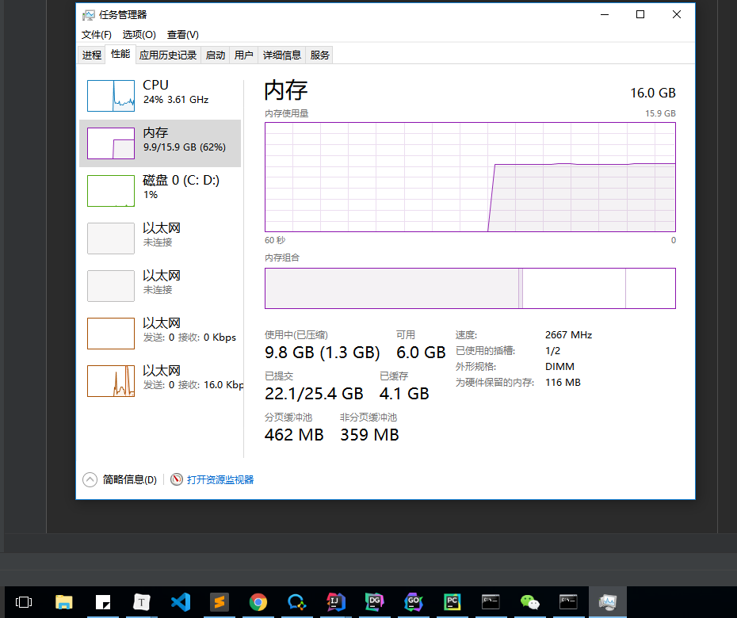

# excel-tools-contrast
比较不同语言间常见的 excel 操作库的粗略性能

> 本项目所有数据均为不严谨的测试数据
>
> 在测试时也不是使用空闲的电脑来跑数
>
> 下图是跑数时电脑的工作情况，虽然每次跑数有性能差异，但是差异绝对不大。

### 准备工作

**电脑信息**

CPU：i5-7500 3.4 GHz 4核

内存：16 GB

硬盘：SSD

**测试文件信息**

格式：xlsx

大小：100 MB

sheet页：3

每个sheet页 855082 行，9 列

### 测试结果

测试基准：读取该文件并打印第一个 sheet 页中每一行的第一列数据

|             | 语言 | 打开时长 | 总时长 | 消耗内存                            |
| ----------- | ---- | -------- | ------ | ----------------------------------- |
| xlrd        | py   | 2m38s    | 2m41s  | 694 mb                              |
| openpyxl    | py   | 5m10s    | 5m18s  | 10157 mb                            |
| xlwings     | py   | 0m35s    | 34m59s | 36 mb + wps （启动:50/打开后:17) mb |
| pandas      | py   | 2m50s    | 2m54s  | 954 mb                              |
| excelize    | go   | 3.76s    | 3m13s  | 6440 mb                             |
| tealeg/xlsx | go   | 2m24s    | 3m55s  | 5689 mb                             |

### 运行代码

#### python

运行前需要执行以下命令安装各种工具库

> pip install psutil openpyxl pandas xlrd xlwings

然后运行 `python` 目录下的各 `*.py` 脚本。

#### golang

使用 goland 打开项目并运行 `golang` 目录下的各 `*.go` 文件

